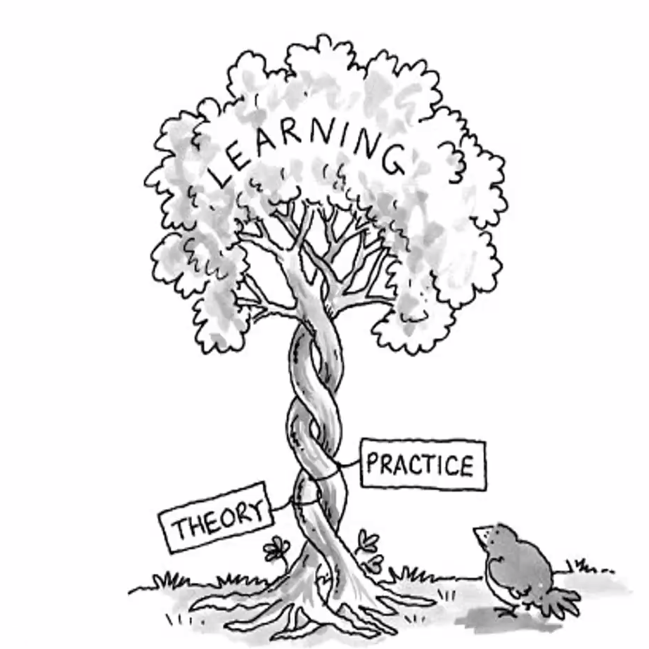

> ⚠ **Warning:**  *Repository is over 500MB. Download only the required files to save data. Contents of the repo is briefed below.*

## LE Robotics Pvt. Ltd.

> With the current global trends, Automation is becoming a key trend in business world as well as in day to day life. However, Sri Lanka in general is still catching up with these technological and life style advancements. There is no argument that the Sri Lankan talent and capabilities in these technical areas can complete with the best in the world. And the potential growth to the Sri Lankan economy with development of local technical businesses would be crucial to make the next breakthrough in national development. But the opportunities available to the young talent to showcase their talent and capabilities are very rare especially since there are very few high-tech businesses in Sri Lanka. In order to provide the necessary encouragement and facilities to the young talent to shine in the technical field while fuelling the trend of new Sri Lankan technical businesses, LE Robotics embarked upon the challenge of designing and building robots in Sri Lanka to introduce industrial robots “Made in Sri Lanka”.

---

## Performance Report

## Conclusion about the Industrial Training

*The special industrial training was a whole new challenge which demanded a different set of
technical skills as well as soft skills. LE Robotics (Pvt.) Ltd. did a great job in injecting much
of those during the period of six months. One of the best achievements of the training is the
mindset that our supervisor built in us, towards working under minimum supervision. This
gave me an opportunity to experience my full potential as an engineering student and revealed
my true calibre. This definitely, will be a massive support for me to thrive in the fast-moving
industry rather than surviving there. Because what I could realize during the training period
was that there will be no one to spoon-feed you in the industry and you have to learn things fast
on your own.*

*As a trainee, I was assigned a project to develop a Computer Vision subsystem for a pick
and place machine. Since there were no experts in the Computer Vision field in the facility,
the entire prototype development process was done individually by myself. Therefore, I could
gain a very strong knowledge about turning an idea into a viable prototype using the available
resources in the facility. During that process, I went over the stages such as idea generation,
research, planning and prototyping. I believe, the process could be accelerated by a large factor
if there was an expert in the Computer Vision field.*

*In the last month of the training period, I had the opportunity to work with our supervisor
and the other employees of the facility for integrating the developed Computer Vision
subsystem with the existing six degrees of freedom articulated robot arm. This taught me the
importance of being a team player and completing the assigned tasks well in advance, to be
successful in the final stages of product development. Because the subsystems/ modules that
are developed by you must be compatible with the subsystem/ modules developed by the other
employees for the system to function as one single unit.*

*From the very beginning of our training period, we had been working and working with no
breaks other than the mercantile holidays and some of the weekends. LE Robotics (Pvt.) Ltd.
was busy getting the work done from their employees and the well-being or the career growth of
the employees was not of their concerns. Because we could not experience any social activity
or additional workshops/ learning opportunities to improve the wellness of its employees. This
was a major weakness of the company that was observed during my internship. Therefore,
I could experience a serious work-life imbalance during the training period which eventually
make me lose interest in the company even though they have a great vision.*

---

## Contents of the Repository

1. [Training Contract](Documents/Forms%20Sent%20to%20NAITA%20and_or%20University/TRAING_CONTRACT.pdf)
2. [Work Site Form](Documents/Forms%20Sent%20to%20NAITA%20and_or%20University/WORK_SITE_FORM.pdf)
3. [Internship Offer Letter](Documents/LER/LE%20Robotics%20-%20Internship%20Offer%20Letter%20-%20B.P.%20Thalagala.pdf)
4. [Daily Diary](Training%20CAs/Daily%20Diary%20180631J.pdf)
5. [Four Weeky Continuous Assessments](Training%20CAs/4-weekly%20CA%20180631J.pdf)
6. [Four Weeky Expected Outcomes Follow-up Reports](Training%20CAs/4-weekly%20EOFR%20180631J.pdf)
7. [Final Presentation](Training%20Presentation/Industrial%20Training.pdf)
8. [Final Report](Training%20Report/EN3992_IT_Report_180631J.pdf)
